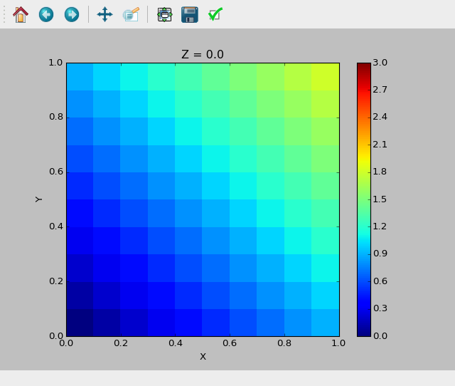

# treslice
Visualize 3D data easily by slicing.

Usage
-----
treslice takes arrays X, Y, Z and C as inputs. X, Y and Z contain the coordinates of the gridpoints, C contains the function values at the gridpoints. It then lets you view colour maps of slices of the data. The underlying implementation relies on matplotlib and specifically [pcolormesh](http://matplotlib.org/api/pyplot_api.html#matplotlib.pyplot.pcolormesh) – you should consult that for more information.

You can call TreSlice from a Python script:
```python
  import numpy as np
  from treslice import TreSlice

  grid = np.linspace(0, 1, 11)
  X, Y, Z = np.meshgrid(grid, grid, grid)
  C = X + Y + Z
  plot = TreSlice(grid, grid, grid, C)
  plot.show()
```
Running the above commands should give you a window like this:


TreSlice calls matplotlib and binds keys so that you can now change the slice you're viewing by pressing up and down arrows (right and left skip 5 slices). Changing the slicing axis is done by pressing space.

Given your grid and the values in a NumPy .npz file as arrays called X, Y, Z and C, you can call treslice from the command line:
```
  python treslice.py datafile.npz
```
or, having treslice.py in your `PYTHONPATH`,
```
  python -m treslice datafile.npz
```

Dependencies
------------
TreSlice runs on Python 3 and depends on matplotlib and NumPy.

Development
-----------
TreSlice was done to scratch a personal itch – to have a simple, lightweight program for exploring slices of a 3D density field. I thought others could have some uses for this too, so it's now published here. If you'd like a feature added, please send a pull request or open an issue. Correspondingly I'll improve the program and implement features as I need them.

